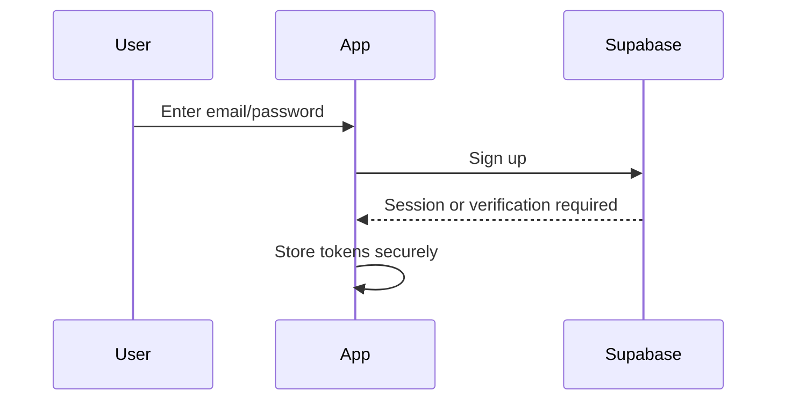

# Authentication

## Signup Flow

## Login Flow

1. User enters credentials.
2. Flutter calls Supabase Auth.
3. Supabase returns access JWT and refresh token.
4. Access token is stored in Secure Storage.
5. Refresh token is stored in Secure Storage.
6. App builds its local session from the authenticated Supabase user.

## JWT

Any future API must verify JWT signature, issuer, audience, expiration, and subject. The authenticated subject maps to `users.auth_provider_id`.

## Refresh Tokens

The mobile app uses Supabase refresh flow before access token expiration. Refresh tokens never go to custom backend endpoints unless specifically required by Supabase SDK behavior.

## Session Handling

- Access token lives briefly.
- Refresh token lives longer and is stored securely.
- App keeps in-memory auth state for runtime.
- On app start, token is loaded from Secure Storage and refreshed if needed.

## Secure Storage

Secure Storage stores access token, refresh token, device ID, and archive encryption keys. Hive must not store secrets.

## Logout

Logout clears in-memory session, Secure Storage tokens, queued sync credentials, and optional local cache depending on user choice.

## Token Expiration

Expired access tokens trigger one refresh attempt. If refresh fails, the app returns to login and preserves non-sensitive local settings.

## Password Reset

Password reset uses Supabase email flow. The app receives links at `tally://auth/callback`; this URL must be added to Supabase Auth redirect URLs. The app then confirms the new password, clears old tokens, and starts a fresh login session.

## Supabase setup

Add `tally://auth/callback` to **Authentication → URL Configuration → Redirect URLs** in the Supabase dashboard. Supply `SUPABASE_URL` and `SUPABASE_ANON_KEY` with `--dart-define` for each environment; the values must belong to the same Supabase project.
