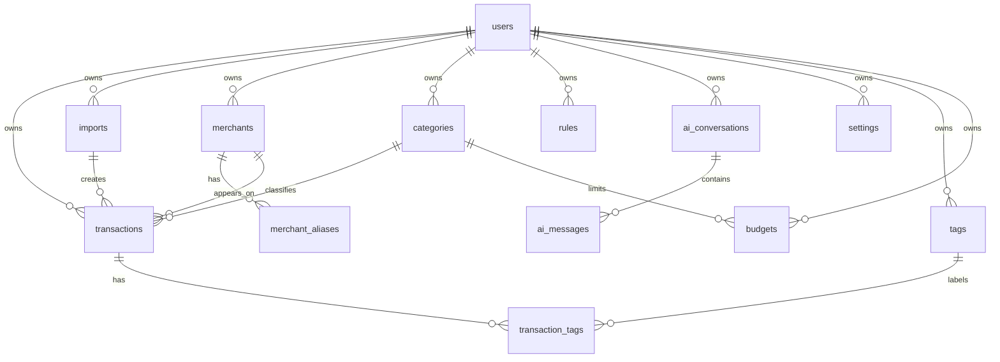

# Database Design

## Principles

- PostgreSQL on Supabase.
- UUID primary keys.
- `user_id` on all user-owned data.
- `created_at`, `updated_at`, and optional `deleted_at`.
- Foreign keys are explicit.
- RLS scopes rows to the authenticated user.
- Sensitive raw statement content is not stored by default.

## ER Diagram

## Tables

### users

Purpose: application user profile linked to Supabase Auth.

Columns:

- `id uuid primary key`
- `auth_provider_id uuid unique not null`
- `email text not null`
- `display_name text`
- `default_currency text not null default 'INR'`
- `created_at timestamptz not null`
- `updated_at timestamptz not null`
- `deleted_at timestamptz`

Indexes: unique `auth_provider_id`, index `email`.

Constraints: valid email format at application layer.

### transactions

Purpose: normalized financial transactions.

Columns:

- `id uuid primary key`
- `user_id uuid not null references users(id)`
- `import_id uuid references imports(id)`
- `merchant_id uuid references merchants(id)`
- `category_id uuid references categories(id)`
- `posted_date date not null`
- `transaction_date date`
- `description text not null`
- `sanitized_description text not null`
- `amount numeric(14,2) not null`
- `direction text not null` (`debit`, `credit`)
- `currency text not null default 'INR'`
- `balance_after numeric(14,2)`
- `source_hash text not null`
- `dedupe_key text not null`
- `notes text`
- `confidence numeric(5,4)`
- `created_at timestamptz not null`
- `updated_at timestamptz not null`
- `deleted_at timestamptz`

Relationships: belongs to user, import, merchant, category; has tags.

Indexes: `(user_id, posted_date desc)`, `(user_id, category_id)`, `(user_id, merchant_id)`, unique partial `(user_id, dedupe_key) where deleted_at is null`.

Constraints: amount > 0; direction enum; sanitized description must not contain detected sensitive identifiers.

### merchants

Purpose: canonical merchant records per user.

Columns:

- `id uuid primary key`
- `user_id uuid not null references users(id)`
- `name text not null`
- `normalized_name text not null`
- `category_id uuid references categories(id)`
- `confidence numeric(5,4)`
- `created_at timestamptz not null`
- `updated_at timestamptz not null`
- `deleted_at timestamptz`

Relationships: belongs to user; optionally belongs to default category; has merchant aliases and transactions.

Indexes: unique partial `(user_id, normalized_name) where deleted_at is null`.

Constraints: `normalized_name` must be generated from a deterministic normalization function; confidence must be between 0 and 1 when present.

### merchant_aliases

Purpose: map raw/sanitized patterns to canonical merchants.

Columns:

- `id uuid primary key`
- `user_id uuid not null references users(id)`
- `merchant_id uuid not null references merchants(id)`
- `alias text not null`
- `normalized_alias text not null`
- `match_type text not null`
- `created_at timestamptz not null`
- `updated_at timestamptz not null`
- `deleted_at timestamptz`

Relationships: belongs to user and merchant.

Indexes: `(user_id, normalized_alias)`, `(merchant_id)`.

Constraints: `match_type` is one of `exact`, `contains`, `regex`; alias must not contain sensitive identifiers after sanitization.

### categories

Purpose: user-visible transaction categories.

Columns:

- `id uuid primary key`
- `user_id uuid references users(id)`
- `name text not null`
- `color_token text`
- `icon_name text`
- `parent_id uuid references categories(id)`
- `is_system boolean not null default false`
- `created_at timestamptz not null`
- `updated_at timestamptz not null`
- `deleted_at timestamptz`

Relationships: may belong to user; may have parent category; classifies transactions, merchants, rules, and future budgets.

Indexes: unique partial `(user_id, name, parent_id) where deleted_at is null`.

Constraints: system categories have `is_system = true`; user categories must have `user_id`; category hierarchy must not contain cycles.

### rules

Purpose: deterministic categorization and merchant assignment rules.

Columns:

- `id uuid primary key`
- `user_id uuid not null references users(id)`
- `name text not null`
- `priority integer not null`
- `field text not null`
- `operator text not null`
- `value text not null`
- `merchant_id uuid references merchants(id)`
- `category_id uuid references categories(id)`
- `tag_id uuid references tags(id)`
- `is_active boolean not null default true`
- `created_at timestamptz not null`
- `updated_at timestamptz not null`
- `deleted_at timestamptz`

Relationships: belongs to user; may assign merchant, category, or tag.

Indexes: `(user_id, is_active, priority)`.

Constraints: `field` and `operator` use allowlisted values; at least one action target must be present.

### imports

Purpose: import session metadata without raw file content.

Columns:

- `id uuid primary key`
- `user_id uuid not null references users(id)`
- `source_type text not null`
- `bank_code text`
- `file_fingerprint text not null`
- `status text not null`
- `row_count integer not null default 0`
- `imported_count integer not null default 0`
- `duplicate_count integer not null default 0`
- `error_count integer not null default 0`
- `privacy_mode text not null`
- `started_at timestamptz not null`
- `completed_at timestamptz`
- `created_at timestamptz not null`
- `updated_at timestamptz not null`
- `deleted_at timestamptz`

Relationships: belongs to user; creates transactions.

Indexes: `(user_id, created_at desc)`, `(user_id, file_fingerprint)`.

Constraints: `source_type` is one of `csv`, `pdf`; `status` is one of `pending`, `parsed`, `completed`, `failed`, `cancelled`; counts must be non-negative; no raw file path or raw content is stored.

### ai_conversations

Purpose: AI chat sessions.

Columns:

- `id uuid primary key`
- `user_id uuid not null references users(id)`
- `title text`
- `context_scope text not null`
- `created_at timestamptz not null`
- `updated_at timestamptz not null`
- `deleted_at timestamptz`

Relationships: belongs to user; contains AI messages.

Indexes: `(user_id, updated_at desc)`.

Constraints: context scope must be an allowlisted value such as `current_month`, `last_90_days`, `year_to_date`, or `custom_range`.

### ai_messages

Purpose: sanitized AI messages and responses.

Columns:

- `id uuid primary key`
- `conversation_id uuid not null references ai_conversations(id)`
- `user_id uuid not null references users(id)`
- `role text not null`
- `content_sanitized text not null`
- `model_provider text`
- `model_name text`
- `token_count integer`
- `created_at timestamptz not null`
- `deleted_at timestamptz`

Relationships: belongs to user and conversation.

Indexes: `(conversation_id, created_at)`.

Constraints: role is one of `user`, `assistant`, `system`; no raw prompt or sensitive identifier storage; token count must be non-negative.

### settings

Purpose: user preferences.

Columns:

- `id uuid primary key`
- `user_id uuid not null references users(id)`
- `key text not null`
- `value_json jsonb not null`
- `created_at timestamptz not null`
- `updated_at timestamptz not null`

Relationships: belongs to user.

Indexes: unique `(user_id, key)`.

Constraints: keys are allowlisted by application policy; privacy-related settings require audited updates.

### tags

Purpose: user labels for transactions.

Columns:

- `id uuid primary key`
- `user_id uuid not null references users(id)`
- `name text not null`
- `color_token text`
- `created_at timestamptz not null`
- `updated_at timestamptz not null`
- `deleted_at timestamptz`

Relationships: belongs to user; relates to transactions through `transaction_tags`.

Indexes: unique partial `(user_id, name) where deleted_at is null`.

Constraints: tag names are trimmed and non-empty.

### transaction_tags

Purpose: many-to-many transaction/tag relation.

Columns:

- `transaction_id uuid not null references transactions(id)`
- `tag_id uuid not null references tags(id)`
- `user_id uuid not null references users(id)`
- `created_at timestamptz not null`

Relationships: joins transactions and tags; belongs to user for RLS scoping.

Indexes: primary key `(transaction_id, tag_id)`, index `(user_id, tag_id)`.

Constraints: transaction, tag, and user must all belong to the same user.

### budgets (future)

Purpose: spending limits by category and period.

Columns:

- `id uuid primary key`
- `user_id uuid not null references users(id)`
- `category_id uuid references categories(id)`
- `name text not null`
- `period text not null`
- `amount numeric(14,2) not null`
- `currency text not null default 'INR'`
- `start_date date not null`
- `end_date date`
- `is_active boolean not null default true`
- `created_at timestamptz not null`
- `updated_at timestamptz not null`
- `deleted_at timestamptz`

Relationships: belongs to user; optionally applies to category.

Indexes: `(user_id, is_active, period)`, `(user_id, category_id)`.

Constraints: amount > 0; `period` is one of `weekly`, `monthly`, `quarterly`, `yearly`, `custom`; `end_date` must be after `start_date` when present.
