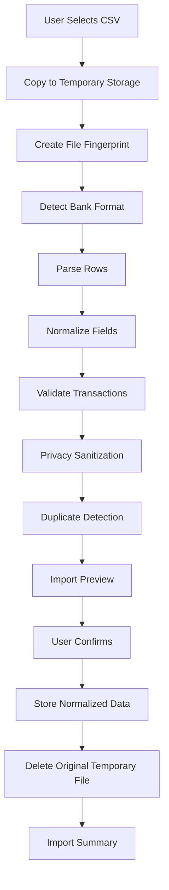

# Import Pipeline

## Goals

The import pipeline converts user-selected bank statements into normalized transactions while minimizing raw file lifetime. CSV is supported first; PDF is future work.

## Flow

## CSV Import

CSV import supports bank-specific schemas through parser adapters. Each adapter defines expected headers, date formats, amount conventions, balance fields, and description handling.

## Temporary Storage

The selected file is copied into app-controlled temporary storage. The app does not parse from arbitrary external locations. Temporary files are deleted after success, cancellation, or recoverable failure cleanup.

## Bank Detection

Detection uses headers, column count, known labels, date formats, and optional user selection. If confidence is low, the user chooses from supported bank formats.

## Parsing

Parsers produce raw row DTOs with row number and source metadata. Parsing errors are collected per row and shown in the preview.

## Normalization

Normalization maps dates, debit/credit amounts, currency, balance, and descriptions into canonical transaction fields.

## Validation

Validation checks required fields, valid dates, positive amounts, supported currency, direction, and impossible balance transitions where applicable.

## Duplicate Detection

Duplicate keys combine user, date, amount, direction, sanitized description, balance if present, and source fingerprint. Existing duplicates are skipped and reported.

## Privacy Sanitization

Descriptions and metadata pass through sensitive-field detection before storage or AI use. Account numbers, IFSC codes, UPI IDs, phone numbers, customer IDs, and statement headers are redacted.

## Database Storage

Only normalized transaction records and import metadata are stored. Raw CSV rows and raw files are not persisted by default.

## Delete Original File

After confirmed successful import, the temporary copied file is deleted. In Maximum Privacy and Cloud Sync modes, no archive remains. In Archive Mode, the file is encrypted before retention.

## Import Summary

The summary includes bank, date range, rows processed, imported count, duplicate count, skipped rows, parser warnings, privacy mode, and deletion/archive result.
