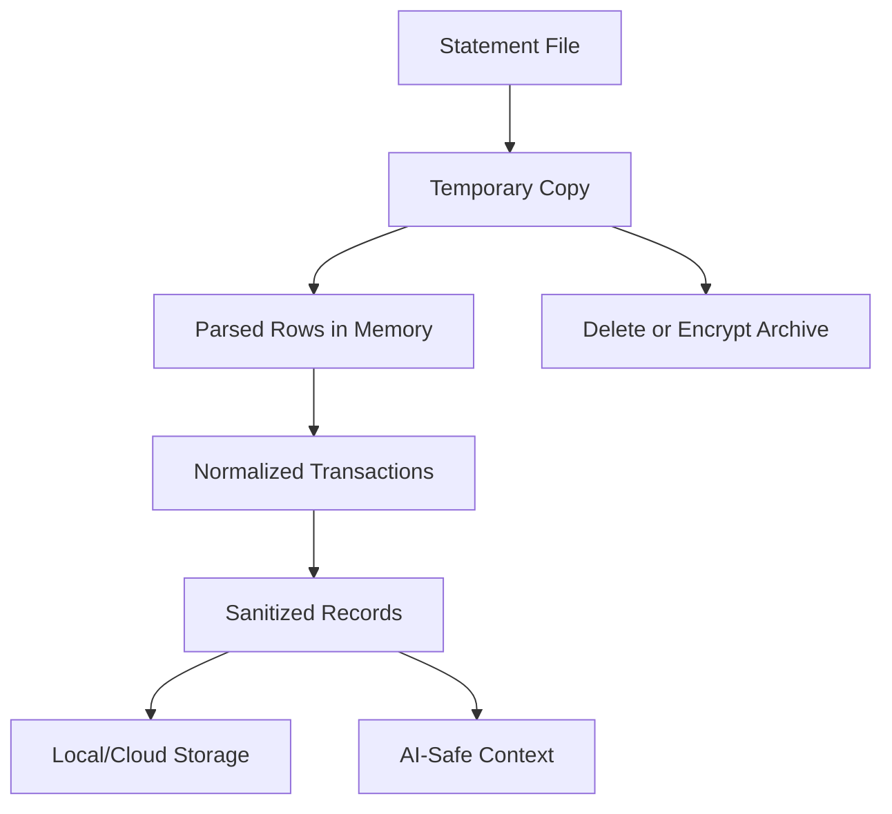

# Privacy Design

## Data Lifecycle

## Sensitive Field Detection

Detect and redact:

- Account numbers.
- IFSC codes.
- UPI IDs.
- Phone numbers.
- Customer IDs.
- Statement headers.
- Card numbers.
- Long numeric identifiers.
- Email addresses in statement metadata.

## Sanitization Rules

- Replace sensitive values with typed placeholders such as `[ACCOUNT_REDACTED]`.
- Remove statement header/footer rows before transaction normalization.
- Store `sanitized_description` separately from parser input.
- Reject AI context generation if sensitive patterns remain.
- Do not store raw row payloads in durable storage.

## File Deletion Policy

Maximum Privacy Mode and Cloud Sync Mode delete temporary files after successful import. Failed imports attempt cleanup immediately and show recovery status. Archive Mode encrypts files before retention and lets the user delete archives later.

## Encrypted Archive Mode

Archive Mode is opt-in. Files are encrypted with a per-user or per-device key stored in Secure Storage. Archived files are never sent to AI and are excluded from normal sync unless an explicit encrypted backup feature is later designed.

## Cloud Synchronization

Cloud Sync Mode uploads normalized, sanitized transaction data and metadata to Supabase. Raw files are not uploaded. Supabase RLS, backend authorization, and audit logging enforce isolation.

## Threat Model

Threats:

- Malicious CSV/PDF content.
- Prompt injection hidden in descriptions.
- Token theft.
- Cross-user data access.
- Sensitive data in logs.
- Device compromise.
- AI provider data exposure.

Mitigations:

- Strict parsing and formula neutralization.
- AI prompt allowlist and redaction.
- Secure Storage for tokens/keys.
- RLS and backend user scoping.
- Structured logs with redaction.
- Minimal retention of sensitive source data.

## Security Assumptions

- Device OS secure storage is trusted for token and key protection.
- Supabase Auth correctly issues and signs JWTs.
- Backend secrets remain server-side.
- AI providers are treated as external processors and receive only sanitized data.
