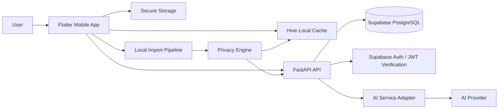
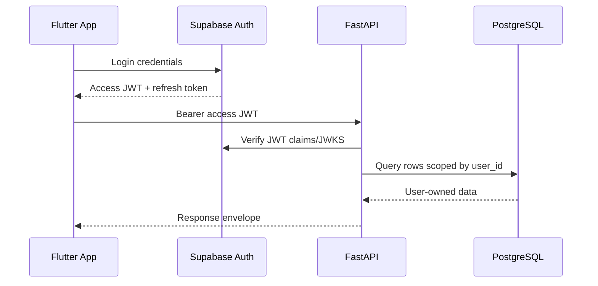
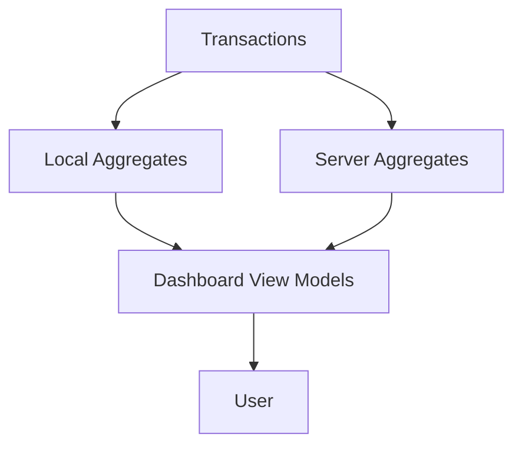
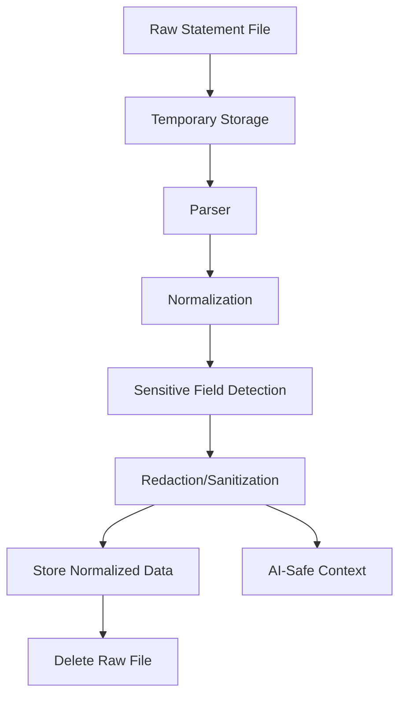
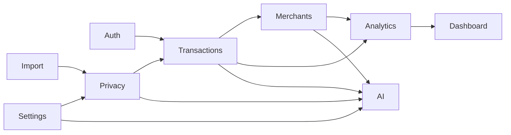

# System Architecture

## Overview

Tally uses a Flutter mobile client, FastAPI backend, Supabase PostgreSQL, SQLAlchemy, Riverpod, Hive, Secure Storage, and an AI service behind a provider abstraction. The system is modular, privacy-first, and offline-capable where practical.

## Flutter

Flutter owns the user experience, local import preparation, offline read models, secure token storage, and privacy mode controls. Riverpod provides dependency injection and state management. Hive stores cached transactions, dashboard summaries, import drafts, and non-secret preferences. Secure Storage stores tokens and encryption keys.

## FastAPI

FastAPI owns authenticated API contracts, transaction persistence, server-side validation, analytics queries, AI request mediation, and sync coordination. It must never accept raw statement uploads in the initial CSV workflow unless a future explicitly documented upload feature is approved.

## Supabase

Supabase provides PostgreSQL, authentication, and RLS. Database access is isolated per user. Application migrations define schema changes. Backend service credentials are never shipped to the mobile app.

## AI Service

The AI service is accessed through an adapter that accepts only sanitized context. Provider-specific clients are hidden behind an interface so future providers can be swapped without changing product behavior.

## Authentication

## Import Pipeline

CSV files are processed locally first. The app copies a selected file into temporary storage, detects bank format, parses rows, normalizes transactions, sanitizes descriptions, checks duplicates, stores normalized records, and deletes the temporary source file by default.

## Analytics Pipeline

Analytics must be reproducible from transactions. Cached summaries are read models, not authoritative records.

## Privacy Pipeline

## Module Interaction

## Component Responsibilities

- Mobile presentation: screens, navigation, local state, accessibility.
- Mobile domain layer: use cases and domain entities.
- Mobile data layer: repositories, API clients, Hive stores, secure storage.
- Backend API layer: routing, authentication, validation, response shaping.
- Backend service layer: business workflows and policy enforcement.
- Backend repository layer: SQLAlchemy persistence.
- Database: durable normalized data with RLS.
- AI adapter: sanitized context only, provider abstraction, retries, confidence parsing.
