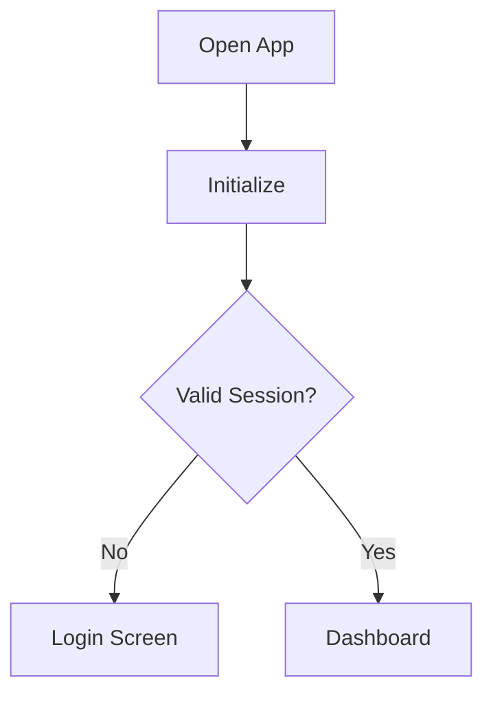
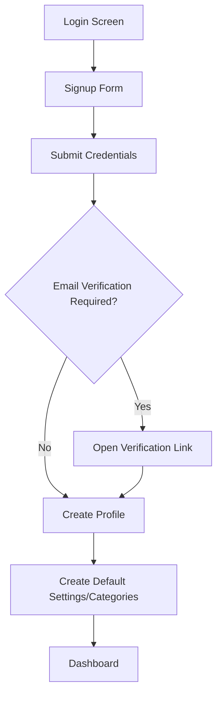
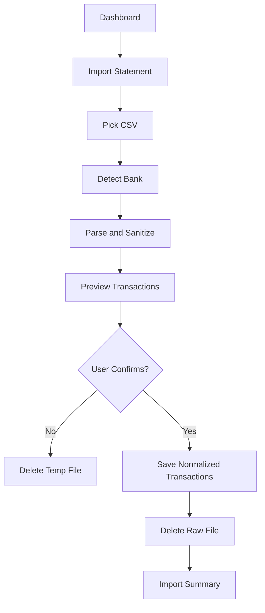
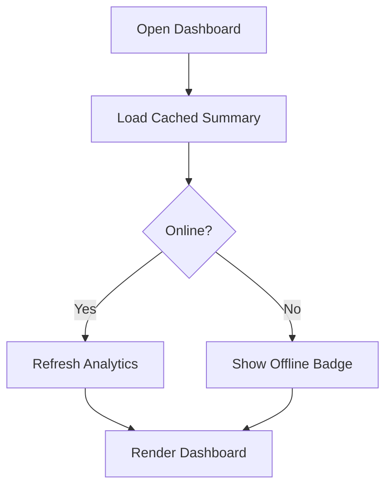
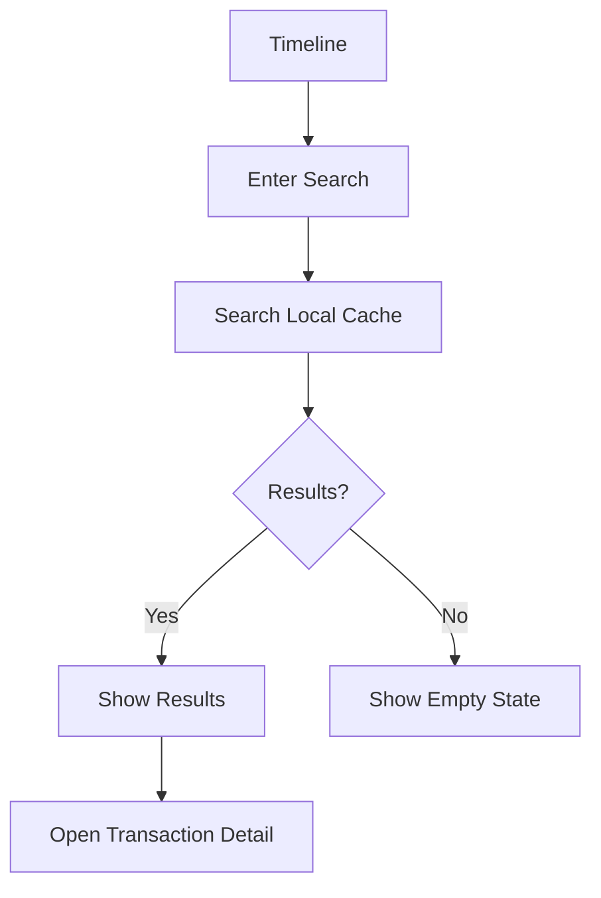
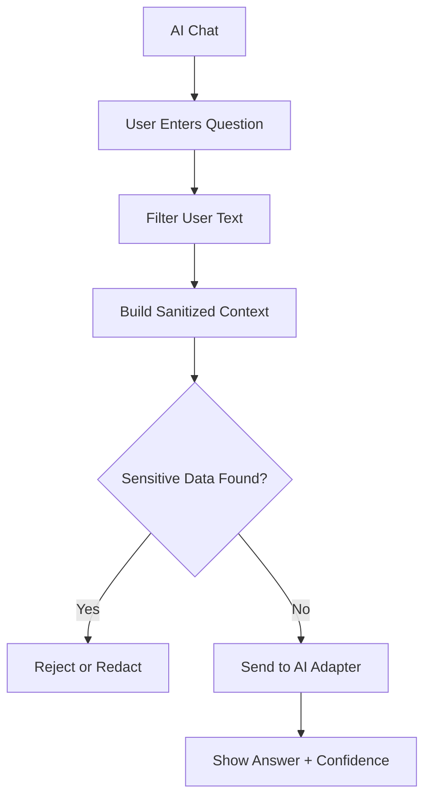
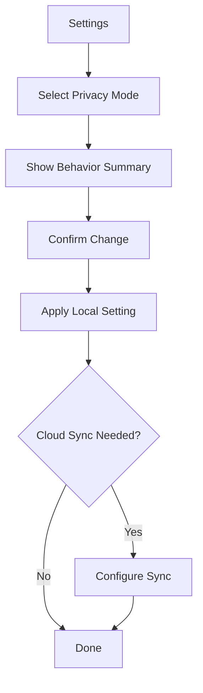
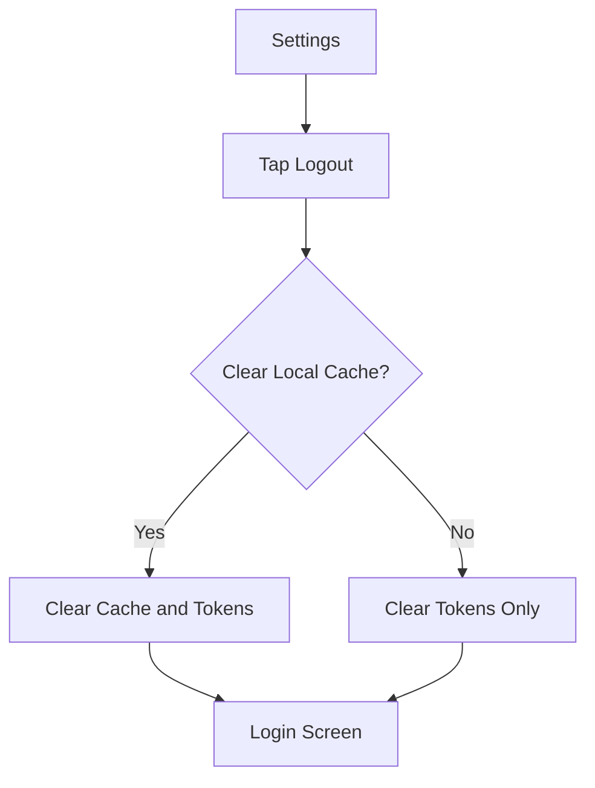

# User Flows

## First Launch

```mermaid
flowchart TD
  Open[Open App] --> Init[Initialize]
  Init --> Session{Valid Session?}
  Session -->|No| Login[Login Screen]
  Session -->|Yes| Dashboard[Dashboard]
```

## Registration

```mermaid
flowchart TD
  Login[Login Screen] --> Signup[Signup Form]
  Signup --> Submit[Submit Credentials]
  Submit --> Verify{Email Verification Required?}
  Verify -->|Yes| Email[Open Verification Link]
  Verify -->|No| Bootstrap[Create Profile]
  Email --> Bootstrap
  Bootstrap --> Defaults[Create Default Settings/Categories]
  Defaults --> Dashboard[Dashboard]
```

## Import Statement

```mermaid
flowchart TD
  Dashboard --> Import[Import Statement]
  Import --> Pick[Pick CSV]
  Pick --> Detect[Detect Bank]
  Detect --> Parse[Parse and Sanitize]
  Parse --> Preview[Preview Transactions]
  Preview --> Confirm{User Confirms?}
  Confirm -->|No| Cleanup[Delete Temp File]
  Confirm -->|Yes| Save[Save Normalized Transactions]
  Save --> Delete[Delete Raw File]
  Delete --> Summary[Import Summary]
```

## View Dashboard

```mermaid
flowchart TD
  Open[Open Dashboard] --> Cache[Load Cached Summary]
  Cache --> Refresh{Online?}
  Refresh -->|Yes| Sync[Refresh Analytics]
  Refresh -->|No| Offline[Show Offline Badge]
  Sync --> Render[Render Dashboard]
  Offline --> Render
```

## Search Transaction

```mermaid
flowchart TD
  Timeline --> Query[Enter Search]
  Query --> Local[Search Local Cache]
  Local --> Results{Results?}
  Results -->|Yes| List[Show Results]
  Results -->|No| Empty[Show Empty State]
  List --> Detail[Open Transaction Detail]
```

## Chat With AI

```mermaid
flowchart TD
  Chat[AI Chat] --> Ask[User Enters Question]
  Ask --> Filter[Filter User Text]
  Filter --> Context[Build Sanitized Context]
  Context --> Safe{Sensitive Data Found?}
  Safe -->|Yes| Reject[Reject or Redact]
  Safe -->|No| Send[Send to AI Adapter]
  Send --> Answer[Show Answer + Confidence]
```

## Change Privacy Mode

```mermaid
flowchart TD
  Settings --> Mode[Select Privacy Mode]
  Mode --> Explain[Show Behavior Summary]
  Explain --> Confirm[Confirm Change]
  Confirm --> Apply[Apply Local Setting]
  Apply --> Sync{Cloud Sync Needed?}
  Sync -->|Yes| Configure[Configure Sync]
  Sync -->|No| Done[Done]
  Configure --> Done
```

## Logout

```mermaid
flowchart TD
  Settings --> Logout[Tap Logout]
  Logout --> Choice{Clear Local Cache?}
  Choice -->|Yes| Clear[Clear Cache and Tokens]
  Choice -->|No| Tokens[Clear Tokens Only]
  Clear --> Login[Login Screen]
  Tokens --> Login
```
